# Laporan 1 : Review Dasar Pemrograman Java
**Mata Kuliah:** Praktikum Dasar Desain Pattern   
**Nama:** Safira Naila
**NIM:** 2024573010066
**Kelas:** TI 2A

---

## BAB I - PENDAHULUAN

### 1.1 Latar Belakang

Java merupakan salah satu bahasa pemrograman yang populer dan banyak digunakan dalam pengembangan aplikasi desktop, web, dan mobile. Java memiliki sintaks yang mirip dengan bahasa C++, namun dirancang agar lebih mudah dipahami dan digunakan oleh pemula dalam mempelajari pemrograman.

Dalam mempelajari pemrograman Java, terdapat beberapa konsep dasar yang penting untuk dipahami, seperti variabel, tipe data, operator, percabangan, dan perulangan. Konsep-konsep tersebut merupakan dasar dalam menulis program serta membantu dalam menyelesaikan berbagai permasalahan menggunakan logika pemrograman.

Pada modul ini dilakukan praktikum menggunakan Java Development Kit (JDK) dan IntelliJ IDEA sebagai lingkungan pengembangan untuk menulis, menjalankan, dan menguji program Java. Melalui praktikum ini, mahasiswa diharapkan dapat memahami sintaks dasar pemrograman Java serta mampu membuat program sederhana menggunakan konsep-konsep dasar yang telah dipelajari.

### 1.2 Tujuan Praktikum

1. Memahami sintaks dasar pemrograman Java.
2.	Mampu membuat program sederhana menggunakan Java.
3.	Memahami konsep variabel, tipe data, operator, percabangan, dan perulangan.
4.	Mampu menyelesaikan masalah sederhana dengan menerapkan konsep dasar pemrograman Java.

## BAB II - PRAKTIKUM
### 2.1 Praktikum 1 - Pengenalan Java dan Lingkungan Pengembangan
#### 2.1.1 Tujuan

Mampu membuat dan menjalankan program Java sederhana.

#### 2.1.2 Langkah Praktikum
1. Buat sebuah package baru di dalam folder src dengan cara klik kanan pada folder src kemudian pilih New -> Package. Beri nama modul_1.
2. Buat Sebuah class didalam package modul_1 dengan cara klik kanan dan pilih New -> Java Class. Beri nama HelloWorld
3. Isikan kode dibawah ini:
```declarative
package praktikum_1;

public class HelloWorld {
public static void main(String[] args) {
System.out.println("Hello, World!"); }
}

```

#### 2.1.3 Hasil Praktikum
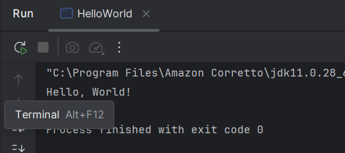

#### 2.1.4 Analisa
Program Java tersebut merupakan program sederhana untuk menampilkan teks “Hello, World!” ke layar. Program berada dalam package praktikum_1 dan memiliki class bernama HelloWorld. Di dalam class terdapat method main() yang merupakan titik awal eksekusi program Java. Perintah System.out.println("Hello, World!"); digunakan untuk mencetak teks ke layar. Saat program dijalankan, output yang dihasilkan adalah tulisan Hello, World! pada console.

### 2.2 Praktikum 2 - Variabel dan Tipe Data
#### 2.2.1 Tujuan 

Mampu menggunakan variabel dan tipe data dalam program Java.

#### 2.2.2 Langkah Praktikum
1. Buat sebuah class baru di dalam package modul_1 dan beri nama Variable
2. Isikan kode dibawah ini:
```declarative
package praktikum_1;

public class Variable {
public static void main(String[] args) {
int umur = 20;
double tinggi = 1.75;
boolean isMahasiswa = true;
char jenisKelamin = 'L';
String nama = "BUdi";

System.out.println("Nama: " + nama);
System.out.println("Umur: " + umur);
System.out.println("Tinggi: " + tinggi);
System.out.println("Mahasiswa: " + isMahasiswa);
System.out.println("Jenis Kelamin: " + jenisKelamin); }
}

```

#### 2.2.3 Hasil Praktikum
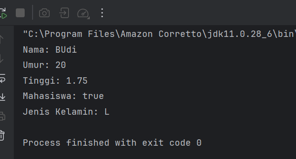

#### 2.2.4 Analisa
Program ini digunakan untuk menunjukkan penggunaan variabel dan tipe data dalam Java. Di dalam method main(), terdapat beberapa variabel dengan tipe data berbeda yaitu int untuk umur, double untuk tinggi, boolean untuk status mahasiswa, char untuk jenis kelamin, dan String untuk nama. Nilai dari setiap variabel kemudian ditampilkan ke layar menggunakan System.out.println(). Saat program dijalankan, program akan menampilkan informasi nama, umur, tinggi, status mahasiswa, dan jenis kelamin di console.

#### 2.2.5 Program Latihan
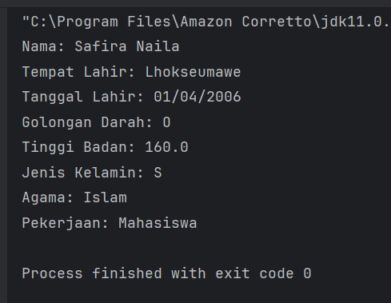

### 2.3 Praktikum 3 - Operator dan Ekspresi
#### 2.3.1 Tujuan

Mampu menggunakan operator dalam operasi pada variabel.

#### 2.3.2 Langkah Praktikum
1. Buat sebuah class baru di dalam package modul_1 dan beri nama Operator
2. Isikan kode dibawah ini:
```declarative
package praktikum_1;

public class Operator {
    public static void main(String[] args) {
        int a = 10;
        int b = 5;

        System.out.println(" a + b = " + (a +b));
        System.out.println("a > b?" + (a > b));
        System.out.println("a == b?" + (a == b));

    }
}

```

#### 2.3.3 Hasil Praktikum
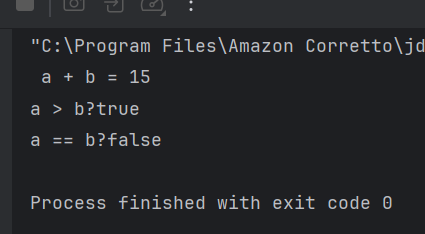

#### 2.3.4 Analisa
Program ini menunjukkan penggunaan operator dalam Java. Terdapat dua variabel bertipe int yaitu a = 10 dan b = 5. Program kemudian melakukan beberapa operasi, yaitu penjumlahan (a + b) menggunakan operator aritmatika, perbandingan (a > b) untuk mengecek apakah a lebih besar dari b, dan perbandingan kesamaan (a == b) untuk mengecek apakah kedua nilai sama. Hasil dari setiap operasi ditampilkan ke layar menggunakan System.out.println()

#### 2.3.5 Program Latihan
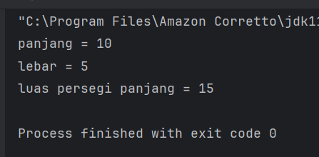

### 2.4 Praktikum 4 -  Percabangan (If-Else dan Switch-Case)
#### 2.4.1 Tujuan

Mengetahui penggunaan if-else dan switch-case.

#### 2.4.2 Langkah Praktikum
1. Buat sebuah class baru di dalam package modul_1 dan beri nama Percabangan
2. Isikan kode dibawah ini:
```declarative
package praktikum_1;

public class Percabangan {
    public static void main(String[] args) {
        int nilai = 85;

        if (nilai >= 75) {
            System.out.println("Anda lulus!");
        } else {
            System.out.println("Anda tidak lulus.");
        }
    }
}
```

#### 2.4.3 Hasil Praktikum
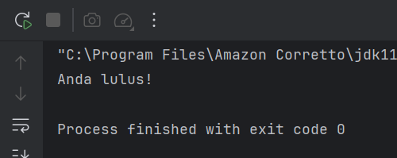

#### 2.4.4 Analisa
Program ini menunjukkan penggunaan percabangan if-else dalam Java. Variabel nilai diberi nilai 85. Program kemudian memeriksa kondisi apakah nilai lebih besar atau sama dengan 75. Jika kondisi tersebut terpenuhi, maka program akan menampilkan pesan “Anda lulus!”, sedangkan jika tidak terpenuhi akan menampilkan “Anda tidak lulus.”. Pada program ini karena nilai 85 ≥ 75, maka output yang muncul adalah “Anda lulus!”.

#### 2.4.5 Program Latihan
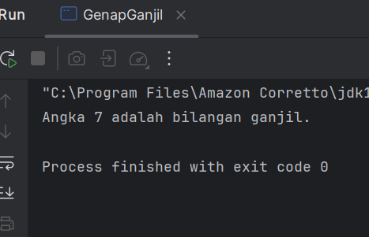

### 2.5 Praktikum 5 -  Perulangan (For, While, Do-While)
#### 2.5.1 Tujuan

Mengetahui penggunaan perulangan for, while, dan do-while.

#### 2.5.2 Langkah Praktikum
1. Buat sebuah class baru di dalam package modul_1 dan beri nama Perulangan
2. Isikan kode dibawah ini:
```declarative
package praktikum_1;

public class Perulangan {
    public static void main(String[] args) {
        for (int i = 1; i <= 5; i++) {
            System.out.println("Iterasi ke-" + i);
        }
    }
}
```

#### 2.5.3 Hasil Praktikum
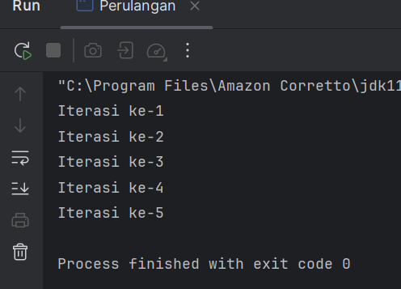

#### 2.5.4 Analisa
Program ini menunjukkan penggunaan perulangan for dalam Java. Perulangan dimulai dari nilai i = 1 dan akan terus berjalan selama i ≤ 5, dengan nilai i bertambah 1 setiap iterasi. Pada setiap perulangan, program akan menampilkan teks “Iterasi ke-” diikuti dengan nilai i menggunakan System.out.println(). Saat program dijalankan, program akan mencetak Iterasi ke-1 sampai Iterasi ke-5 di layar.

#### 2.5.5 Program Latihan
* Program dengan for
```declarative
package praktikum_1.latihan;

public class ForGanjil {
    public static void main(String[] args) {
        for (int i = 1; i <= 20; i++) {
            if (i % 2 != 0) {
                System.out.println(i);
            }
        }
    }
}
```
* Program dengan while
```declarative
package praktikum_1.latihan;

public class WhileGanjil {
    public static void main(String[] args) {
        int i = 1;

        while (i <= 20) {
            if (i % 2 != 0) {
                System.out.println(i);
            }
            i++;
        }
    }
}
```
* Program dengan do-while
```declarative
package praktikum_1.latihan;

public class DoWhileGanjil {
    public static void main(String[] args) {
        int i = 1;

        do {
            if (i % 2 != 0) {
                System.out.println(i);
            }
            i++;
        } while (i <= 20);
    }
}
```

### 2.6 Praktikum 6 -  Practice Problem dan Solusinya
#### 2.6.1 Tujuan

Membuat program untuk menghitung faktorial suatu bilangan.

#### 2.6.2 Langkah Praktikum
1. Buat sebuah class baru di dalam package modul_1 dan beri nama Factorial dan isikan kode berikut. Kemudian jalankan untuk melihat hasilnya.
```declarative
package praktikum_1;

public class Faktorial {
    public static void main(String[] args) {
        int n = 5;
        int hasil = 1;
        for (int i = 1; i <= n; i++) {
            hasil *= i;
        }
        System.out.println("Faktorial dari " + n + " adalah " + hasil);
    }
}

```
#### 2.6.3 Hasil Praktikum
1. Program Faktorial
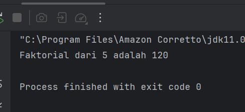

2. Buat sebuah class baru di dalam package modul_1 dan beri nama Prima dan isikan kode berikut. Kemudian jalankan untuk melihat hasilnya.
```declarative
package praktikum_1;

public class Prima {
    public static void main(String[] args) {
        int n = 7;
        boolean isPrima = true;

        for (int i = 2; i <= n / 2; i++) {
            if (n % i == 0) {
                isPrima = false;
                break;
            }
        }

        System.out.println(n + (isPrima ? " adalah bilangan prima." : " bukan bilangan prima."));
    }
}

```
2. Program Bilangan Prima
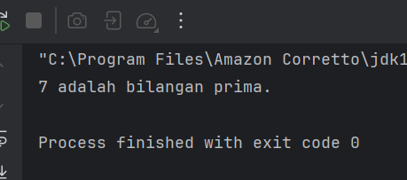

3. Buat sebuah class baru di dalam package modul_1 dan beri nama Segitiga dan isikan kode berikut. Kemudian jalankan untuk melihat hasilnya.
```declarative
package praktikum_1;

public class Segitiga {
    public static void main(String[] args) {
        int tinggi = 5;

        for (int i = 1; i <= tinggi; i++) {
            for (int j = 1; j <= i; j++) {
                System.out.print("* ");
            }
            System.out.println();
        }
    }
}

```
3. Program Pola Segitiga
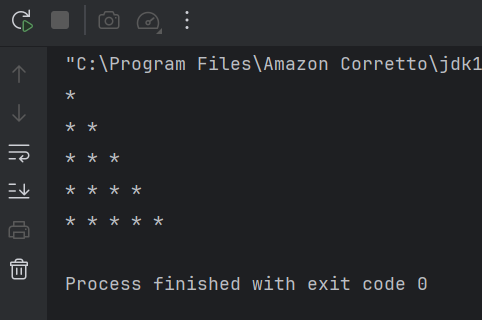

#### 2.6.4 Analisa
Ketiga program tersebut merupakan contoh penerapan konsep dasar pemrograman Java untuk menyelesaikan beberapa masalah sederhana. Program Faktorial digunakan untuk menghitung nilai faktorial dari suatu bilangan menggunakan perulangan. Program Prima digunakan untuk mengecek apakah suatu bilangan termasuk bilangan prima atau bukan dengan menggunakan percabangan dan perulangan. Sedangkan program Segitiga digunakan untuk mencetak pola segitiga menggunakan tanda * dengan memanfaatkan perulangan bersarang (nested loop).


## BAB III - PENUTUP

### 3.1 Kesimpulan

Berdasarkan praktikum yang telah dilakukan, dapat disimpulkan bahwa bahasa pemrograman Java memiliki sintaks yang cukup mudah dipahami untuk membuat program sederhana. Melalui praktikum ini dipelajari beberapa konsep dasar pemrograman seperti variabel, tipe data, operator, percabangan, dan perulangan. Konsep-konsep tersebut digunakan untuk membuat berbagai program sederhana seperti menampilkan data, melakukan operasi perhitungan, menentukan kondisi, serta membuat pola. Dengan memahami dasar-dasar tersebut, mahasiswa dapat mulai mengembangkan kemampuan dalam membuat program Java yang lebih kompleks

---

## BAB IV - REFERENSI
Modul Praktikum 7 by Pak Muhammad Reza Zulman, S.ST., M.Sc.
* https://hackmd.io/@mohdrzu/BJlT87vJZe

