# Laporan 2 : Konsep Dasar dan 4 Pilar OOP
**Mata Kuliah:** Praktikum Dasar Desain Pattern   
**Nama:** Safira Naila
**NIM:** 2024573010066
**Kelas:** TI 2A

---

## BAB I - PENDAHULUAN

### 1.1 Latar Belakang
Pemrograman berorientasi objek atau Object-Oriented Programming (OOP) merupakan paradigma pemrograman yang banyak digunakan dalam pengembangan perangkat lunak modern. OOP memungkinkan pengembang untuk memodelkan dunia nyata ke dalam bentuk objek-objek yang saling berinteraksi, sehingga kode yang dihasilkan lebih terstruktur, mudah dipahami, dan dapat digunakan kembali (reusable).

Java adalah salah satu bahasa pemrograman yang sepenuhnya mendukung paradigma OOP. Dalam Java, setiap program dibangun dari class dan object yang memiliki atribut dan method. Selain itu, Java juga mendukung empat pilar utama OOP yaitu Encapsulation, Inheritance, Polymorphism, dan Abstraction yang menjadi fondasi dalam membangun aplikasi yang modular dan terstruktur.

Laporan ini disusun berdasarkan hasil praktikum Lab 02 dan Lab 03 yang membahas konsep dasar OOP serta implementasi empat pilar OOP menggunakan bahasa pemrograman Java. Melalui praktikum ini, diharapkan mahasiswa dapat memahami dan menerapkan konsep-konsep tersebut dalam membangun program sederhana berbasis OOP.

### 1.2 Tujuan Praktikum
1. Memahami konsep dasar pemrograman berorientasi objek (OOP) dalam Java.
2. Mampu membuat dan menggunakan class, object, attribute, dan method.
3. Memahami penggunaan akses modifier (public, private, protected, dan default).
4. Mampu mengimplementasikan setter dan getter untuk mengakses dan memodifikasi attribute.
5. Memahami dan mengimplementasikan constructor (default, parameterized, dan constructor overloading).
6. Memahami dan mengimplementasikan empat pilar OOP yaitu Encapsulation, Inheritance, Polymorphism, dan Abstraction.
7. Mampu membuat program sederhana menggunakan konsep OOP di lingkungan IntelliJ IDEA.

## BAB II - PEMBAHASAN

### 2.1 Konsep Dasar

#### 2.1.1 Class dan Object

**Teori**

Class adalah blueprint atau cetakan untuk membuat objek. Class mendefinisikan atribut (variabel) dan method (fungsi) yang dimiliki oleh objek. Object adalah instance dari class yang memiliki state (nilai dari atribut) dan behavior (method).

**Langkah Praktikum**
1. Buka project pada praktikum sebelumnya menggunakan IntelliJ IDEA.
2. Buat package baru di dalam folder `src`, beri nama `praktikum_2`.
3. Buat package baru di dalam package `praktikum_2`, beri nama `bagian_1`.
4. Buat class baru dengan nama `Mahasiswa` dan isikan kode berikut:

```java
package praktikum_2.bagian_1;

public class Mahasiswa {
    String nama;
    int umur;
}
```

5. Buat class baru dengan nama `Main` dan isikan kode berikut:

```java
package praktikum_2.bagian_1;

public class Main {
    public static void main(String[] args) {
        Mahasiswa mhs1 = new Mahasiswa();
        mhs1.nama = "Budi";
        mhs1.umur = 20;

        System.out.println("Nama: " + mhs1.nama);
        System.out.println("Umur: " + mhs1.umur);
    }
}
```
6. Jalankan program dan lihat hasilnya.

**Output Praktikum**
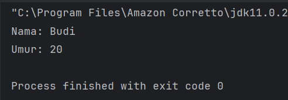

---

**Latihan**
1. Buatlah class `Buku` dengan atribut `judul` dan `pengarang`.
2. Buat object dari class `Buku` dan isi nilai atributnya.
3. Tampilkan nilai atribut tersebut.

**Kode Latihan**

```java
// Buku.java
package praktikum_2.latihan.latihan_1;

public class Buku {
    String judul;
    String pengarang;
}
```

```java
// Main.java
package praktikum_2.latihan.latihan_1;

public class Main {
    public static void main(String[] args) {
        Buku buku1 = new Buku();
        buku1.judul = "Belajar Java";
        buku1.pengarang = "Ahmad Rizky";

        System.out.println("Judul     : " + buku1.judul);
        System.out.println("Pengarang : " + buku1.pengarang);
    }
}
```

**Output Latihan**
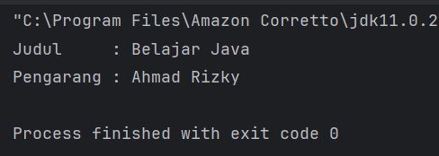

#### 2.1.2 Attribute dan Method

**Teori**

Attribute adalah variabel yang dimiliki oleh class atau object.
Method adalah fungsi atau perilaku yang dimiliki oleh class atau object.

**Langkah Praktikum**
1. Buat Sebuah package baru lagi didalam package `praktikum_2` dengan cara klik kanan dan pilih New -> Package. Beri nama `bagian_2`
2. Kemudian buat sebuah class baru dengan nama `Kalkulator` dan isikan kode berikut:
```Java
package praktikum_2.bagian_2;

public class Kalkulator {
    // Atribut
    int angka1;
    int angka2;

    // Method
    int tambah() {
        return angka1 + angka2;
    }
}
```
3. Kemudian buat sebuah class baru dengan nama `Main` dan isikan kode berikut:
```Java
package praktikum_2.bagian_2;

public class Main {
    public static void main(String[] args) {
        Kalkulator kalkulator = new Kalkulator();
        kalkulator.angka1 = 5;
        kalkulator.angka2 = 10;

        System.out.println("Hasil Penjumlahan: " + kalkulator.tambah());
    }
}
```
4. Jalankan program untuk melihat hasilnya.

**Output Praktikum**
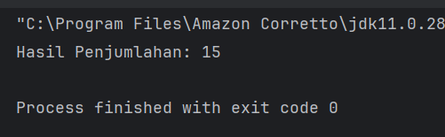

---

**Latihan**
1. Buat class `Lingkaran` dengan atribut `jariJari`.
2. Tambahkan method hitungLuas() yang mengembalikan nilai luas lingkaran.
3. Buat object dari class `Lingkaran` dan panggil method hitungLuas().

**Kode Latihan**
```Java
package praktikum_2.latihan_2;

public class Lingkaran {
    // Atribut
    double jariJari;

    // Method
    double hitungLuas() {
        return Math.PI * jariJari * jariJari;
    }
}
```
```Java
package praktikum_2.latihan_2;

public class Main {
    public static void main(String[] args) {
        // Membuat object dari class Lingkaran
        Lingkaran lingkaran = new Lingkaran();

        // Mengisi nilai atribut
        lingkaran.jariJari = 7;

        // Memanggil method hitungLuas()
        System.out.println("Jari-jari : " + lingkaran.jariJari);
        System.out.println("Luas      : " + lingkaran.hitungLuas());
    }
}
```
**Output Latihan**
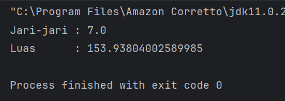

#### 2.1.3 Akses Modifier

**Teori**

1. Akses Modifier menentukan tingkat akses dari class, atribut, atau method.
2. Jenis akses modifier:
   public : Dapat diakses dari mana saja.
   private : Hanya dapat diakses dalam class yang sama.
   protected : Dapat diakses dalam package yang sama dan subclass.
   default : Hanya dapat diakses dalam package yang sama.

**Langkah Praktikum**
1. Buat Sebuah package baru lagi didalam package `praktikum_2` dengan cara klik kanan dan pilih New -> Package. Beri nama `bagian_3`
2. Kemudian buat sebuah class baru dengan nama AksesModifier dan isikan kode berikut:
```Java
package praktikum_2.bagian_3;

public class AksesModifier {
    public int publicVar = 1;
    private int privateVar = 2;
    protected int protectedVar = 3;
    int defaultVar = 4; // default

    public void tampilkan() {
        System.out.println("Public: " + publicVar);
        System.out.println("Private: " + privateVar);
        System.out.println("Protected: " + protectedVar);
        System.out.println("Default: " + defaultVar);
    }
}
```
3. Kemudian buat sebuah class baru dengan nama Main dan isikan kode berikut:
```Java
package praktikum_2.bagian_3;

public class Main {
    public static void main(String[] args) {
        AksesModifier contoh = new AksesModifier();
        contoh.tampilkan();

        // System.out.println(contoh.privateVar); // Error: privateVar tidak dapat diakses
    }
}
```
4. Jalankan program untuk melihat hasilnya.

**Output Praktikum**
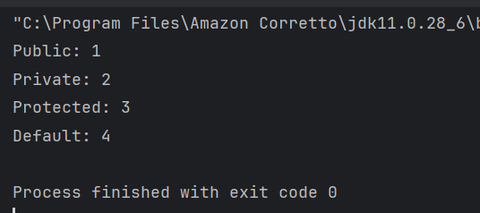

---

**Latihan**
1. Buat class `AkunBank` dengan atribut `saldo (private)` dan method `tampilkanSaldo() (public)`.
2. Coba akses atribut saldo langsung dari luar class. Apa yang terjadi?

**Kode Latihan**
```Java
package praktikum_2.latihan_3;

public class AkunBank {
    // Atribut private - tidak bisa diakses langsung dari luar class
    private double saldo = 1000000;

    // Method public - bisa diakses dari mana saja
    public void tampilkanSaldo() {
        System.out.println("Saldo : Rp " + saldo);
    }
}
```
```Java
package praktikum_2.latihan_3;

public class Main {
    public static void main(String[] args) {
        AkunBank akun = new AkunBank();

        // Mengakses method public - BERHASIL
        akun.tampilkanSaldo();

        // Mengakses atribut private langsung - ERROR
        // System.out.println(akun.saldo); // Error: saldo has private access in AkunBank
    }
}
```
**Output Latihan**
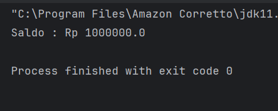

#### 2.1.4 Setter dan Getter

**Teori**

Setter adalah method untuk mengubah nilai atribut.
Getter adalah method untuk mengambil nilai atribut.
Setter dan Getter digunakan untuk mengakses atribut yang memiliki akses modifier private.

**Langkah Praktikum**
1. Buat Sebuah package baru lagi didalam package `praktikum_2` dengan cara klik kanan dan pilih New -> Package. Beri nama `bagian_4`
2. Kemudian buat sebuah class baru dengan nama `Mobil` dan isikan kode berikut:
```Java
package praktikum_2.bagian_4;

public class Mobil {
    private String merk;

    // Setter
    public void setMerk(String merk) {
        this.merk = merk;
    }

    // Getter
    public String getMerk() {
        return merk;
    }

}

```
3. Kemudian buat sebuah class baru dengan nama `Main` dan isikan kode berikut:
```Java
package praktikum_2.bagian_4;

public class Main {
    public static void main(String[] args) {
        Mobil mobil = new Mobil();
        mobil.setMerk("Toyota");

        System.out.println("Merk Mobil: " + mobil.getMerk());
    }
}
```
4. Jalankan program untuk melihat hasilnya.

**Output Praktikum**
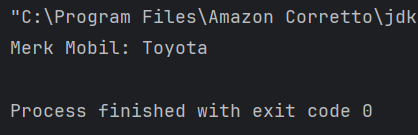

---

**Latihan**
1. Buat class `Mahasiswa` dengan atribut `nama (private)` dan `nim (private)`.
2. Buat setter dan getter untuk kedua atribut tersebut.
3. Buat object dari class Mahasiswa dan gunakan setter untuk mengisi nilai atribut.

**Kode Latihan**
```Java
package praktikum_2.latihan_4;

public class Mahasiswa {
    // Atribut private
    private String nama;
    private String nim;

    // Setter
    public void setNama(String nama) {
        this.nama = nama;
    }

    public void setNim(String nim) {
        this.nim = nim;
    }

    // Getter
    public String getNama() {
        return nama;
    }

    public String getNim() {
        return nim;
    }
}
```
```Java
package praktikum_2.latihan_4;

public class Main {
    public static void main(String[] args) {
        // Membuat object dari class Mahasiswa
        Mahasiswa mhs = new Mahasiswa();

        // Mengisi nilai atribut menggunakan setter
        mhs.setNama("Budi");
        mhs.setNim("2024001");

        // Menampilkan nilai atribut menggunakan getter
        System.out.println("Nama : " + mhs.getNama());
        System.out.println("NIM  : " + mhs.getNim());
    }
}
```
**Output Latihan**
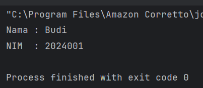

#### 2.1.5 Constructor

**Teori**

1. Constructor adalah method khusus yang dipanggil saat object dibuat.
2. Jenis constructor:
   Default Constructor : Tanpa parameter.
   Parameterized Constructor : Dengan parameter.
   Constructor Overloading : Beberapa constructor dengan parameter berbeda.

**Langkah Praktikum**
1. Buat Sebuah package baru lagi didalam package `praktikum_2` dengan cara klik kanan dan pilih New -> Package. Beri nama `bagian_5`
2. Kemudian buat sebuah class baru dengan nama `Person` dan isikan kode berikut:
```Java
package praktikum_2.bagian_5;

public class Person {
    private String nama;
    private int umur;

    // Default Constructor
    public Person() {
        nama = "Unknown";
        umur = 0;
    }

    // Parameterized Constructor
    public Person(String nama, int umur) {
        this.nama = nama;
        this.umur = umur;
    }

    // Method
    public void tampilkanInfo() {
        System.out.println("nama: " + nama);
        System.out.println("umur: " + umur);

    }
}

```
3. Kemudian buat sebuah class baru dengan nama `Main` dan isikan kode berikut:
```Java
package praktikum_2.bagian_5;

public class Main {
    public static void main(String[] args) {
        Person person1 = new Person();
        Person person2 = new Person("Budi", 25);

        person1.tampilkanInfo();
        person1.tampilkanInfo();
    }
}

```
4. Jalankan program untuk melihat hasilnya.

**Output Praktikum**
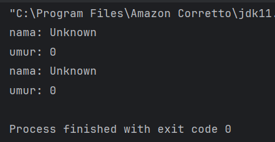

---

**Latihan**
1. Buat class `Barang` dengan atribut `namaBarang` dan `harga`.
2. Buat default `constructor` dan `parameterized constructor`.
3. Buat object dari class `Barang` menggunakan kedua constructor tersebut.

**Kode Latihan**
```Java
package praktikum_2.latihan_5;

public class Barang {
    private String namaBarang;
    private double harga;

    // Default Constructor
    public Barang() {
        namaBarang = "Unknown";
        harga = 0;
    }

    // Parameterized Constructor
    public Barang(String namaBarang, double harga) {
        this.namaBarang = namaBarang;
        this.harga = harga;
    }

    // Method tampilkan info
    public void tampilkanInfo() {
        System.out.println("Nama Barang : " + namaBarang);
        System.out.println("Harga       : Rp " + harga);
    }
}
```
```Java
package praktikum_2.latihan_5;

public class Main {
    public static void main(String[] args) {
        // Menggunakan default constructor
        Barang barang1 = new Barang();
        System.out.println("=== Barang 1 (Default Constructor) ===");
        barang1.tampilkanInfo();

        System.out.println();

        // Menggunakan parameterized constructor
        Barang barang2 = new Barang("Laptop", 8500000);
        System.out.println("=== Barang 2 (Parameterized Constructor) ===");
        barang2.tampilkanInfo();
    }
}

```
**Output Latihan**
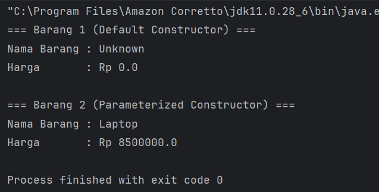

#### 2.1.6 Sistem Manajemen Perpustakaan Sederhana

**Teori**

Berikut adalah contoh program konsol sederhana yang mengimplementasikan seluruh konsep yang telah dibahas sebelumnya, yaitu class, object, attribute, method, akses modifier, setter-getter, dan constructor. Program ini adalah sistem manajemen perpustakaan sederhana yang memungkinkan pengguna untuk menambahkan buku, menampilkan daftar buku, dan mencari buku berdasarkan judul.

**Langkah Praktikum**
1. Buat Sebuah package baru lagi didalam package `praktikum_2` dengan cara klik kanan dan pilih New -> Package. Beri nama `bagian_6`
2. Kemudian buat sebuah class baru dengan nama `Buku` dan isikan kode berikut:
```Java
package praktikum_2.bagian_6;

public class Buku {
    // Atribut (private)
    private String judul;
    private String pengarang;
    private int tahunTerbit;

    // Constructor (default)
    public Buku() {
        this.judul = "Unknown";
        this.pengarang = "Unknown";
        this.tahunTerbit = 0;
    }

    // Constructor (parameterized)
    public Buku(String judul, String pengarang, int tahunTerbit) {
        this.judul = judul;
        this.pengarang = pengarang;
        this.tahunTerbit = tahunTerbit;
    }

    // Setter dan Getter
    public void setJudul(String judul) {
        this.judul = judul;
    }

    public String getJudul() {
        return judul;
    }

    public void setPengarang(String pengarang) {
        this.pengarang = pengarang;
    }

    public String getPengarang() {
        return pengarang;
    }

    public void setTahunTerbit(int tahunTerbit) {
        this.tahunTerbit = tahunTerbit;
    }

    public int getTahunTerbit() {
        return tahunTerbit;
    }

    // Method untuk menampilkan informasi buku
    public void tampilkanInfo() {
        System.out.println("Judul: " + judul);
        System.out.println("Pengarang: " + pengarang);
        System.out.println("Tahun Terbit: " + tahunTerbit);
        System.out.println("---------------------------");
    }
}
```
3. Kemudian buat sebuah class baru dengan nama `Perpustakaan` dan isikan kode berikut:
```Java
package praktikum_2.bagian_6;
import java.util.ArrayList;

public class Perpustakaan {
    // Atribut (private)
    private ArrayList<Buku> daftarBuku;

    // Constructor
    public Perpustakaan() {
        daftarBuku = new ArrayList<>();
    }

    // Method untuk menambahkan buku
    public void tambahBuku(Buku buku) {
        daftarBuku.add(buku);
        System.out.println("Buku berhasil ditambahkan!");
    }

    // Method untuk menampilkan semua buku
    public void tampilkanSemuaBuku() {
        if (daftarBuku.isEmpty()) {
            System.out.println("Tidak ada buku dalam perpustakaan.");
        } else {
            System.out.println("Daftar Buku:");
            for (Buku buku : daftarBuku) {
                buku.tampilkanInfo();
            }
        }
    }

    // Method untuk mencari buku berdasarkan judul
    public void cariBuku(String judul) {
        boolean ditemukan = false;
        for (Buku buku : daftarBuku) {
            if (buku.getJudul().equalsIgnoreCase(judul)) {
                System.out.println("Buku ditemukan:");
                buku.tampilkanInfo();
                ditemukan = true;
                break;
            }
        }
        if (!ditemukan) {
            System.out.println("Buku dengan judul \"" + judul + "\" tidak ditemukan.");
        }
    }
}
```
4. Kemudian buat sebuah class baru dengan nama `Main` dan isikan kode berikut:
```java
package praktikum_2.bagian_6;

import java.util.Scanner;

public class Main {
    public static void main(String[] args) {
        Scanner scanner = new Scanner(System.in);
        Perpustakaan perpustakaan = new Perpustakaan();
        int pilihan;

        do {
            // Menu
            System.out.println("\n=== Sistem Manajemen Perpustakaan ===");
            System.out.println("1. Tambah Buku");
            System.out.println("2. Tampilkan Semua Buku");
            System.out.println("3. Cari Buku");
            System.out.println("4. Keluar");
            System.out.print("Pilih menu: ");
            pilihan = scanner.nextInt();
            scanner.nextLine(); // Membersihkan newline

            switch (pilihan) {
                case 1:
                    // Tambah Buku
                    System.out.print("Masukkan judul buku: ");
                    String judul = scanner.nextLine();
                    System.out.print("Masukkan nama pengarang: ");
                    String pengarang = scanner.nextLine();
                    System.out.print("Masukkan tahun terbit: ");
                    int tahunTerbit = scanner.nextInt();
                    scanner.nextLine(); // Membersihkan newline

                    Buku bukuBaru = new Buku(judul, pengarang, tahunTerbit);
                    perpustakaan.tambahBuku(bukuBaru);
                    break;

                case 2:
                    // Tampilkan Semua Buku
                    perpustakaan.tampilkanSemuaBuku();
                    break;

                case 3:
                    // Cari Buku
                    System.out.print("Masukkan judul buku yang dicari: ");
                    String judulCari = scanner.nextLine();
                    perpustakaan.cariBuku(judulCari);
                    break;

                case 4:
                    // Keluar
                    System.out.println("Terima kasih telah menggunakan sistem ini!");
                    break;

                default:
                    System.out.println("Pilihan tidak valid. Silakan coba lagi.");
            }
        } while (pilihan != 4);

        scanner.close();
    }
}
```
4. Jalankan program untuk melihat hasilnya.

**Output Praktikum**
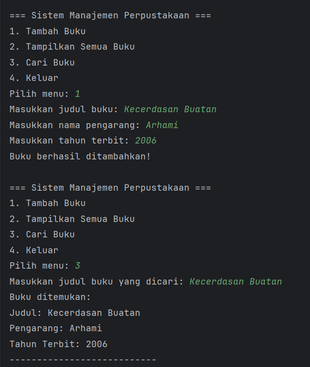

### 2.2 4 Pillar OOP

#### 2.2.1 Pengenalan OOP dan Class-Object

**Teori**

OOP (Object-Oriented Programming) adalah paradigma pemrograman yang menggunakan "objek" untuk merepresentasikan data dan metode yang beroperasi pada data tersebut. 
Konsep dasar OOP:
1. Class: Blueprint atau template untuk membuat objek.
2. Object: Instance dari class yang memiliki atribut dan metode.

**Langkah Praktikum**
1. Buka project pada praktikum sebelumnya menggunakan intellij IDEA
2. Buat sebuah package baru di dalam folder `src` dengan cara klik kanan pada folder src kemudian pilih New -> Package. Beri nama `praktikum_3`.
3. Buat Sebuah package baru lagi didalam package praktikum_3 dengan cara klik kanan dan pilih New -> Package. Beri nama `bagian_1`
4. Kemudian buat sebuah class baru dengan nama `Mahasiswa` dan isikan kode berikut:
```Java
package praktikum_3.bagian_1;

public class Mahasiswa {
    // Atribut
    String nama;
    int umur;

    // Metode
    void displayInfo() {
        System.out.println("Nama: " + nama);
        System.out.println("Umur: " + umur);

    }
}

```
5. Selanjutnya, buat sebuah class baru dengan nama `Main` dan isikan kode berikut:
```Java
package praktikum_3.bagian_1;

public class Main {
    public static void main(String[] args) {
        // Membuat objek
        Mahasiswa mhs1 = new Mahasiswa();
        mhs1.nama = "Budi";
        mhs1.umur = 20;

        // Memanggil metode
        mhs1.displayInfo();
    }
}

```
6. Jalankan dan lihat hasilnya.

**Output Praktikum**
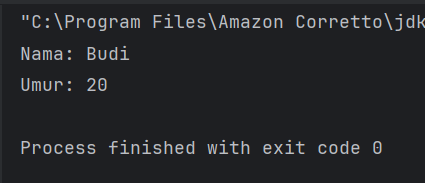

---

**Latihan**
1. Buat class `Buku` dengan atribut `judul`, `penulis`, dan `tahunTerbit`.
2. Buat objek dari class Buku dan tampilkan informasinya.

**Kode Latihan**
```java
package praktikum_3.bagian_1.latihan;

public class Buku {
    // Atribut
    String judul;
    String penulis;
    int tahunTerbit;

    // Metode
    void displayInfo() {
        System.out.println("Judul     : " + judul);
        System.out.println("Penulis   : " + penulis);
        System.out.println("Tahun Terbit : " + tahunTerbit);
    }
}
```
```java
package praktikum_3.bagian_1.latihan;

public class Main {
    public static void main(String[] args) {
        // Membuat objek dari class Buku
        Buku buku1 = new Buku();
        buku1.judul = "Belajar Java";
        buku1.penulis = "Ahmad Rizky";
        buku1.tahunTerbit = 2023;

        // Menampilkan informasi buku
        buku1.displayInfo();
    }
}
```
**Output Latihan**
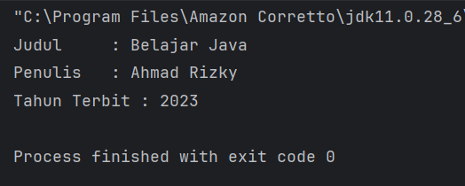

#### 2.2.2 Encapsulation (Enkapsulasi)

**Teori**

Encapsulation adalah konsep menyembunyikan detail internal objek dan hanya mengekspos fungsionalitas yang diperlukan. Ini dilakukan dengan menggunakan access modifier (private, public, protected) dan getter-setter.

**Langkah Praktikum**
1. Buat Sebuah package baru lagi didalam package `praktikum_3` dengan cara klik kanan dan pilih New -> Package. Beri nama `bagian_2`
2. Kemudian buat sebuah class baru dengan nama `Mahasiswa` dan isikan kode berikut:
```java
package praktikum_3.bagian_2;

public class Mahasiswa {
    // Atribut private
    private String nama;
    private int umur;

    // Getter dan Setter
    public String getNama() {
        return nama;
    }

    public void setNama(String nama) {
        this.nama = nama;
    }

    public int getUmur() {
        return umur;
    }

    public void setUmur(int umur) {
        this.umur = umur;
    }
}

```
3. Kemudian buat sebuah class baru dengan nama `Main` dan isikan kode berikut:
```java
package praktikum_3.bagian_2;

public class Main {
    public static void main(String[] args) {
        Mahasiswa mhs1 = new Mahasiswa();
        mhs1.setNama("Budi");
        mhs1.setUmur(20);

        System.out.println("Nama: " + mhs1.getNama());
        System.out.println("Umur: " + mhs1.getUmur());
    }
}
```
4. Jalankan dan lihat hasilnya.

**Output Praktikum**
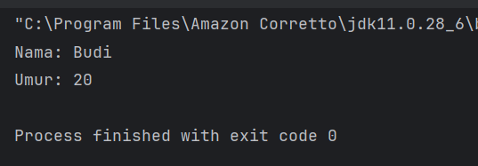

---

**Latihan**
1. Buat class `Motor` dengan atribut `merk` dan `tahun` yang dienkapsulasi.
2. Buat getter dan setter untuk atribut tersebut.

**Kode Latihan**
```java
package praktikum_3.bagian_2.latihan;

public class Motor {
    // Atribut private (enkapsulasi)
    private String merk;
    private int tahun;

    // Getter dan Setter untuk merk
    public String getMerk() {
        return merk;
    }

    public void setMerk(String merk) {
        this.merk = merk;
    }

    // Getter dan Setter untuk tahun
    public int getTahun() {
        return tahun;
    }

    public void setTahun(int tahun) {
        this.tahun = tahun;
    }
}
```
```java
package praktikum_3.bagian_2.latihan;

public class Main {
    public static void main(String[] args) {
        // Membuat objek Motor
        Motor motor1 = new Motor();
        motor1.setMerk("Honda");
        motor1.setTahun(2022);

        // Menampilkan informasi motor
        System.out.println("Merk  : " + motor1.getMerk());
        System.out.println("Tahun : " + motor1.getTahun());
    }
}

```
**Output Latihan**
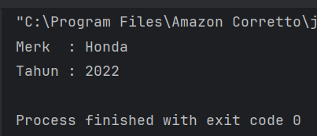

#### 2.2.3 Inheritance (Pewarisan) dan Composition (Komposisi)

**Teori**

Dalam pemrograman berorientasi objek (OOP), Inheritance dan Composition adalah dua konsep penting yang digunakan untuk membangun hubungan antara class. Meskipun keduanya memiliki tujuan yang sama, yaitu mempromosikan reuseability (penggunaan kembali kode) dan modularitas, mereka memiliki pendekatan yang berbeda. Berikut adalah penjelasan lengkap tentang Composition dan perbandingannya dengan Inheritance.

**Inheritance (Pewarisan)**
adalah mekanisme di mana sebuah class (subclass/child class) mewarisi atribut dan metode dari class lain (superclass/parent class). Inheritance menggambarkan hubungan "is-a" (adalah). Misalnya, Kucing adalah Hewan.

Ciri-Ciri Inheritance:
- Menggunakan keyword extends.
- Subclass mewarisi semua atribut dan metode dari superclass (kecuali yang private).
- Subclass dapat menambahkan atribut dan metode baru, atau meng-override metode yang ada.
- Mendukung hierarki class (class dapat mewarisi dari satu superclass).

**Composition (Komposisi)**
adalah mekanisme di mana sebuah class terdiri dari objek-objek dari class lain. Ini menggambarkan hubungan "has-a" (memiliki). Misalnya, Mobil memiliki Mesin. Composition memungkinkan kita untuk membangun class yang kompleks dengan menggabungkan objek-objek yang lebih sederhana.

Ciri-Ciri Composition:
- Menggunakan instance variabel dari class lain.
- Tidak ada keyword khusus, hanya menggunakan objek sebagai atribut.
- Lebih fleksibel daripada inheritance karena tidak terikat pada hierarki class.
- Mendukung reuseability tanpa perlu mewarisi class.

**A. Inheritance (Pewarisan)**

**Langkah Praktikum**
1. Buat Sebuah package baru lagi didalam package `praktikum_3` dengan cara klik kanan dan pilih New -> Package. Beri nama `bagian_3`
2. Buat package baru di dalam bagian_3 dan beri nama `pewarisan`
3. Kemudian buat sebuah class baru dengan nama `Kendaraan` dan isikan kode berikut:
```java
package praktikum_3.bagian_3.pewarisan;

class Kendaraan {
    String merk;
    int tahun;

    void displayInfo() {
        System.out.println("Merk: " + merk);
        System.out.println("Tahun: " + tahun);
    }
}
```
4. Kemudian buat sebuah class baru dengan nama `Mobil` dan isikan kode berikut:
```java
package praktikum_3.bagian_3.pewarisan;

class Mobil extends Kendaraan {
    int jumlahPintu;

    void displayInfoMobil() {
        displayInfo(); // Memanggil metode dari superclass
        System.out.println("Jumlah Pintu: " + jumlahPintu);
    }
}
```
5. Kemudian buat sebuah class baru dengan nama `Main` dan isikan kode berikut:
```java
package praktikum_3.bagian_3.pewarisan;

public class Main {
    public static void main(String[] args) {
        Mobil mobil1 = new Mobil();
        mobil1.merk = "Toyota";
        mobil1.tahun = 2021;
        mobil1.jumlahPintu = 4;

        mobil1.displayInfoMobil();
    }
}
```
6. Jalankan program dan lihat hasilnya.

**Output Praktikum**

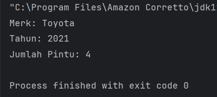

**B. Composition (Komposisi)**

**Langkah Praktikum**
1. Buat package baru di dalam `bagian_3` dan beri nama `komposisi`
2. Kemudian buat sebuah class baru dengan nama `Mesin` dan isikan kode berikut:
```java
package praktikum_3.bagian_3.komposisi;

class Mesin {
    void hidupkan() {
        System.out.println("Mesin menyala.");
    }

    void matikan() {
        System.out.println("Mesin dimatikan.");
    }
}
```
3. Kemudian buat sebuah class baru dengan nama `Mobil` dan isikan kode berikut:
```java
package praktikum_3.bagian_3.pewarisan;

class Mobil extends Kendaraan {
    int jumlahPintu;

    void displayInfoMobil() {
        displayInfo(); // Memanggil metode dari superclass
        System.out.println("Jumlah Pintu: " + jumlahPintu);
    }
}
```
4. Kemudian buat sebuah class baru dengan nama `Main` dan isikan kode berikut:
```java
package praktikum_3.bagian_3.komposisi;

public class Main {
    public static void main(String[] args) {
        Mobil mobil = new Mobil();
        mobil.mulai();
        mobil.berhenti();
    }
}
```
5. Jalankan program dan lihat hasilnya.

**Output Praktikum**

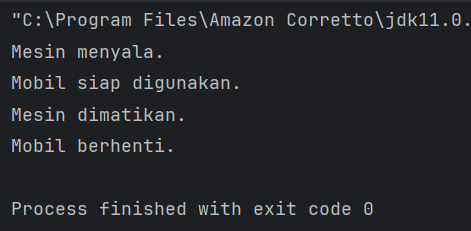

**Latihan**
1. Buat class Laptop yang memiliki komponen Processor dan RAM (gunakan composition).
2. Buat class Processor dengan metode jalankan().
3. Buat class RAM dengan metode baca() dan tulis().
4. Implementasikan class Laptop yang menggunakan objek Processor dan RAM.

**Kode Latihan**
- class Laptop
```java
package praktikum_3.bagian_3.latihan;

public class Laptop {
    // Composition - Laptop memiliki Processor dan RAM
    private final Processor processor;
    private final RAM ram;

    public Laptop() {
        this.processor = new Processor();
        this.ram = new RAM();
    }

    void nyalakan() {
        System.out.println("Laptop menyala...");
        processor.jalankan();
        ram.baca();
        ram.tulis();
        System.out.println("Laptop siap digunakan.");
    }
}

```
- class Processor
```java
package praktikum_3.bagian_3.latihan;

public class Processor {
    void jalankan() {
        System.out.println("Processor sedang menjalankan proses.");
    }
}

```
- class RAM
```java
package praktikum_3.bagian_3.latihan;

public class RAM {
    void baca() {
        System.out.println("RAM sedang membaca data.");
    }

    void tulis() {
        System.out.println("RAM sedang menulis data.");
    }
}

```
- class Main
```java
package praktikum_3.bagian_3.latihan;

public class Main {
    public static void main(String[] args) {
        Laptop laptop1 = new Laptop();
        laptop1.nyalakan();
    }
}

```
**Ouput Latihan**
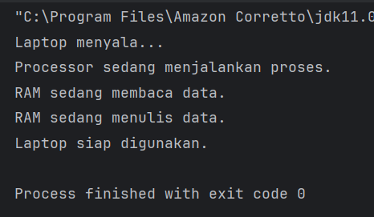

#### 2.2.4 Polymorphism (Polimorfisme)

**Teori**

Polymorphism memungkinkan objek untuk memiliki banyak bentuk. Ini dapat dicapai melalui method overriding (mengganti metode di subclass) dan method overloading (beberapa metode dengan nama sama tetapi parameter berbeda).

**Method Overriding**
terjadi ketika subclass (class anak) menyediakan implementasi spesifik untuk method yang sudah didefinisikan di superclass (class induk). Method overriding digunakan untuk mengubah atau memperluas perilaku method yang diwarisi dari superclass. Method yang di-override harus memiliki nama, parameter, dan return type yang sama dengan method di superclass.

Aturan Method Overriding:
- Method harus memiliki nama dan parameter yang sama dengan method di superclass.
- Return type harus sama atau subtype dari return type di superclass.
- Access modifier tidak boleh lebih restriktif daripada method di superclass (misalnya, jika method di superclass protected, method di subclass bisa protected atau public).
- Method tidak bisa di-override jika di superclass dideklarasikan sebagai final.

**Method Overloading**
terjadi ketika sebuah class memiliki beberapa method dengan nama yang sama tetapi parameter yang berbeda (baik jumlah atau tipe parameternya). Method overloading digunakan untuk meningkatkan fleksibilitas dengan menyediakan beberapa cara untuk memanggil method yang sama.

Aturan Method Overloading:
- Method harus memiliki nama yang sama.
- Parameter harus berbeda (jumlah atau tipe).
- Return type bisa sama atau berbeda (tidak mempengaruhi overloading).
- Access modifier bisa sama atau berbeda.

**A. Method Overriding**

**Langkah Praktikum**
1. Buat Sebuah package baru lagi didalam package `praktikum_3` dengan cara klik kanan dan pilih New -> Package. Beri nama `bagian_4`
2. Kemudian buat sebuah package baru di dalam bagian_4 dan beri nama `overriding`
3. Kemudian buat sebuah class baru dengan nama `Hewan` dan isikan kode berikut:
```java
package praktikum_3.bagian_4.overriding;

public class Hewan {
    void bersuara() {
        System.out.println("Hewan bersuara.");
    }
}

```
4. Kemudian buat sebuah class baru dengan nama `Kucing` dan isikan kode berikut:
```java
package praktikum_3.bagian_4.overriding;

class Kucing extends Hewan {
    @Override
    void bersuara() {
        System.out.println("Meong!");
    }
}

```
5. Kemudian buat sebuah class baru dengan nama `Anjing` dan isikan kode berikut:
```java
package praktikum_3.bagian_4.overriding;

class Anjing extends Hewan {
    @Override
    void bersuara() {
        System.out.println("Guk Guk!");
    }
}

```
6. Kemudian buat sebuah class baru dengan nama `Main` dan isikan kode berikut:
```java
package praktikum_3.bagian_4.overriding;

public class Main {
    public static void main(String[] args) {
        Hewan hewan1 = new Kucing(); // Polymorphism
        Hewan hewan2 = new Anjing(); // Polymorphism

        hewan1.bersuara(); // Output: Meong!
        hewan2.bersuara(); // Output: Guk Guk!
    }
}

```
7. Jalankan program untuk melihat hasilnya.

**Output Praktikum**
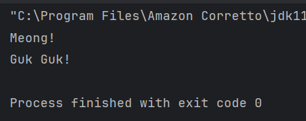

**B. Method Overloading**

**Langkah Praktikum**
1. Buat sebuah package baru di dalam `bagian_4` dan beri nama `overloading`
2. Kemudian buat sebuah class baru dengan nama `Kalkulator` dan isikan kode berikut:
```java
package praktikum_3.bagian_4.overloading;

class Kalkulator {
    // Method overloading: penjumlahan dua bilangan bulat
    int tambah(int a, int b) {
        return a + b;
    }

    // Method overloading: penjumlahan tiga bilangan bulat
    int tambah(int a, int b, int c) {
        return a + b + c;
    }

    // Method overloading: penjumlahan dua bilangan desimal
    double tambah(double a, double b) {
        return a + b;
    }
}
```
4. Kemudian buat sebuah class baru dengan nama `Main` dan isikan kode berikut:
```java
package praktikum_3.bagian_4.overloading;

public class Main {
    public static void main(String[] args) {
        Kalkulator kalkulator = new Kalkulator();

        System.out.println("Hasil 1: " + kalkulator.tambah(5, 10)); // Output: 15
        System.out.println("Hasil 2: " + kalkulator.tambah(5, 10, 15)); // Output: 30
        System.out.println("Hasil 3: " + kalkulator.tambah(3.5, 2.5)); // Output: 6.0
    }
}

```
**Output Praktikum**
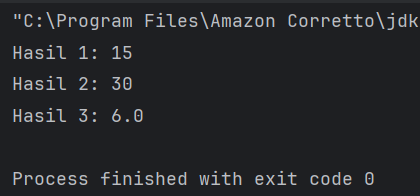

**Latihan**

**Latihan 1: Overriding**
1. Buat class `BangunDatar` dengan method hitungLuas().
2. Buat subclass `Persegi` dan `Lingkaran` yang meng-override method hitungLuas().
3. Implementasikan method hitungLuas() di masing-masing subclass.
- class BangunDatar
```java
package praktikum_3.bagian_4.overriding.latihan;

public class BangunDatar {
    void hitungLuas() {
        System.out.println("Menghitung luas bangun datar.");
    }
}

```
- subclass Persegi
```java
package praktikum_3.bagian_4.overriding.latihan;

public class Persegi extends BangunDatar {
    private double sisi;

    public Persegi(double sisi) {
        this.sisi = sisi;
    }

    @Override
    void hitungLuas() {
        double luas = sisi * sisi;
        System.out.println("Luas Persegi : " + luas);
    }
}

```
- subclass Lingkaran
```java
package praktikum_3.bagian_4.overriding.latihan;

public class Lingkaran extends BangunDatar {
    private double jariJari;

    public Lingkaran(double jariJari) {
        this.jariJari = jariJari;
    }

    @Override
    void hitungLuas() {
        double luas = Math.PI * jariJari * jariJari;
        System.out.println("Luas Lingkaran : " + luas);
    }
}

```
- class Main
```java
package praktikum_3.bagian_4.overriding.latihan;

public class Main {
    public static void main(String[] args) {
        BangunDatar b1 = new Persegi(5);
        BangunDatar b2 = new Lingkaran(7);

        b1.hitungLuas();
        b2.hitungLuas();
    }
}
```
**Output Latihan**
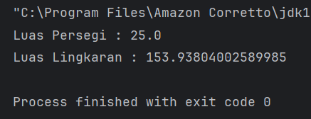

**Latihan 2: Overloading**
1. Buat class `Matematika` dengan method tambah() yang dapat menerima 2 atau 3 parameter bertipe int.
2. Tambahkan method tambah() yang menerima 2 parameter bertipe double.
```java
package praktikum_3.bagian_4.overloading.latihan;

public class Matematika {
    int tambah(int a, int b) {
        return a + b;
    }

    int tambah(int a, int b, int c) {
        return a + b + c;
    }

    double tambah(double a, double b) {
        return a + b;
    }
}


```
```java
package praktikum_3.bagian_4.overloading.latihan;

public class Main {
    public static void main(String[] args) {
        Matematika mat = new Matematika();
        System.out.println("Hasil 1 : " + mat.tambah(5, 10));
        System.out.println("Hasil 2 : " + mat.tambah(5, 10, 15));
        System.out.println("Hasil 3 : " + mat.tambah(3.5, 2.5));
    }
}

```
**Output Latihan**
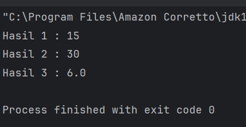

#### 2.2.5 Abstraction (Abstraksi)

**Teori**

Abstraction memungkinkan kita untuk menyembunyikan detail implementasi dan hanya menampilkan fungsionalitas yang diperlukan kepada pengguna. Di Java, abstraction dapat diimplementasikan menggunakan Abstract Class dan Interface.

---

**A. Abstract Class**

Abstract class adalah class yang tidak dapat diinstansiasi secara langsung. Abstract class dapat memiliki method abstrak (tanpa implementasi) dan method konkret (dengan implementasi).

Ciri-Ciri Abstract Class:
- Dideklarasikan dengan keyword `abstract`.
- Dapat memiliki atribut, method konkret, dan method abstrak.
- Method abstrak tidak memiliki body (hanya deklarasi).
- Subclass yang mewarisi abstract class harus mengimplementasikan semua method abstrak.

**Langkah Praktikum**
1. Buat package baru di dalam `bagian_5`, beri nama `abstrak`.
2. Buat class baru dengan nama `Hewan` dan isikan kode berikut:
```java
package praktikum_3.bagian_5.abstrak;

abstract class Hewan {
    String nama;

    void makan() {
        System.out.println(nama + " sedang makan.");
    }

    abstract void bersuara();
}
```
3. Buat class baru dengan nama `Kucing` dan isikan kode berikut:
```java
package praktikum_3.bagian_5.abstrak;

class Kucing extends Hewan {
    @Override
    void bersuara() {
        System.out.println("Meong!");
    }
}
```
4. Buat class baru dengan nama `Anjing` dan isikan kode berikut:
```java
package praktikum_3.bagian_5.abstrak;

class Anjing extends Hewan {
    @Override
    void bersuara() {
        System.out.println("Guk Guk!");
    }
}
```
5. Buat class baru dengan nama `Main` dan isikan kode berikut:
```java
package praktikum_3.bagian_5.abstrak;

public class Main {
    public static void main(String[] args) {
        Hewan hewan1 = new Kucing();
        hewan1.nama = "Kitty";
        hewan1.makan();
        hewan1.bersuara();

        Hewan hewan2 = new Anjing();
        hewan2.nama = "Buddy";
        hewan2.makan();
        hewan2.bersuara();
    }
}
```
6. Jalankan program dan lihat hasilnya.

**Output Praktikum**

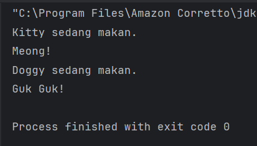

---

**B. Interface**

Interface adalah blueprint untuk class yang mendefinisikan kontrak yang harus diimplementasikan oleh class-class yang menggunakannya. Sebuah class dapat mengimplementasikan banyak interface.

Ciri-Ciri Interface:
- Dideklarasikan dengan keyword `interface`.
- Semua method secara default adalah `public` dan `abstract`.
- Mulai Java 8, interface dapat memiliki method `default` dan `static`.
- Tidak dapat memiliki atribut non-static (hanya konstanta `public static final`).

**Langkah Praktikum**
1. Buat package baru di dalam `bagian_5`, beri nama `antarmuka`.
2. Buat interface baru dengan nama `Bergerak` dan isikan kode berikut:
```java
package praktikum_3.bagian_5.antarmuka;

interface Bergerak {
    void bergerak();

    default void berhenti() {
        System.out.println("Berhenti bergerak.");
    }

    static void info() {
        System.out.println("Ini adalah interface Bergerak.");
    }
}
```
3. Buat class baru dengan nama `Mobil` dan isikan kode berikut:
```java
package praktikum_3.bagian_5.antarmuka;

class Mobil implements Bergerak {
    @Override
    public void bergerak() {
        System.out.println("Mobil sedang bergerak.");
    }
}
```
4. Buat class baru dengan nama `Pesawat` dan isikan kode berikut:
```java
package praktikum_3.bagian_5.antarmuka;

class Pesawat implements Bergerak {
    @Override
    public void bergerak() {
        System.out.println("Pesawat sedang terbang.");
    }
}
```
5. Buat class baru dengan nama `Main` dan isikan kode berikut:
```java
package praktikum_3.bagian_5.antarmuka;

public class Main {
    public static void main(String[] args) {
        Bergerak b1 = new Mobil();
        Bergerak b2 = new Pesawat();

        b1.bergerak();
        b1.berhenti();

        b2.bergerak();
        b2.berhenti();

        Bergerak.info();
    }
}
```
6. Jalankan program dan lihat hasilnya.

**Output Praktikum**

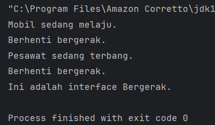

---

**C. Kombinasi Abstract Class dan Interface**

**Langkah Praktikum**
1. Di dalam package `bagian_5`, buat class baru dengan nama `Main` dan isikan kode berikut:
```java
package praktikum_3.bagian_5;

interface Terbang {
    void terbang();
}

// Abstract Class
abstract class Hewan {
    String nama;

    abstract void bersuara();
}

// Class yang mewarisi abstract class dan mengimplementasikan interface
class Burung extends Hewan implements Terbang {
    @Override
    void bersuara() {
        System.out.println("Kicau kicau!");
    }

    @Override
    public void terbang() {
        System.out.println(nama + " sedang terbang.");
    }
}

public class Main {
    public static void main(String[] args) {
        Burung burung = new Burung();
        burung.nama = "Merpati";
        burung.bersuara();
        burung.terbang();
    }
}

```
2. Jalankan program dan lihat hasilnya.

**Output Praktikum**

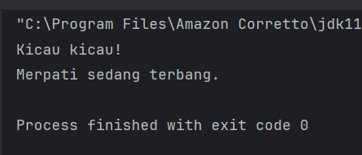

---

**Latihan**
1. Buat sebuah interface `Berenang` dengan method `berenang()`.
2. Buat abstract class `HewanAir` dengan atribut `nama` dan method abstrak `makan()`.
3. Buat class `Ikan` yang mewarisi `HewanAir` dan mengimplementasikan `Berenang`.
4. Implementasikan method `berenang()` dan `makan()` di class `Ikan`.

**Kode Latihan**
```java
// Berenang.java
package praktikum_3.bagian_5.latihan;

public interface Berenang {
    void berenang();
}
```
```java
// HewanAir.java
package praktikum_3.bagian_5.latihan;

public abstract class HewanAir {
    String nama;

    public HewanAir(String nama) {
        this.nama = nama;
    }

    abstract void makan();
}
```
```java
// Ikan.java
package praktikum_3.bagian_5.latihan;

public class Ikan extends HewanAir implements Berenang {

    public Ikan(String nama) {
        super(nama);
    }

    @Override
    public void berenang() {
        System.out.println(nama + " sedang berenang.");
    }

    @Override
    void makan() {
        System.out.println(nama + " sedang makan.");
    }
}
```
```java
// Main.java
package praktikum_3.bagian_5.latihan;

public class Main {
    public static void main(String[] args) {
        Ikan ikan = new Ikan("Nemo");
        ikan.berenang();
        ikan.makan();
    }
}
```

**Output Latihan**

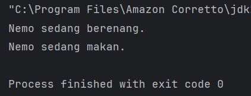

#### 2.2.6 Aplikasi Console Pemesanan Tiket Sederhana

**Teori**

Bagian ini merupakan implementasi seluruh konsep OOP yang telah dipelajari, meliputi Class, Object, Encapsulation, Inheritance, Polymorphism, dan Abstraction dalam sebuah aplikasi console pemesanan tiket konferensi.

Konsep OOP yang diterapkan:
- **Encapsulation**: Atribut seperti `jenis` dan `harga` dienkapsulasi dalam class `Tiket`.
- **Inheritance**: `TiketReguler` dan `TiketVIP` mewarisi class `Tiket`.
- **Polymorphism**: Method `hitungDiskon()` di-override di subclass.
- **Abstraction**: Class `Tiket` adalah abstract class dengan method abstrak `hitungDiskon()`.

**Langkah Praktikum**
1. Buat package baru di dalam `bagian_6`.
2. Buat class baru dengan nama `Tiket` dan isikan kode berikut:
```java
package praktikum_3.bagian_6;

abstract class Tiket {
    private final String jenis;
    private final double harga;

    public Tiket(String jenis, double harga) {
        this.jenis = jenis;
        this.harga = harga;
    }

    public String getJenis() {
        return jenis;
    }

    public double getHarga() {
        return harga;
    }

    // Abstract method untuk menghitung diskon
    public abstract double hitungDiskon();
}
```
3. Buat class baru dengan nama `TiketReguler` dan isikan kode berikut:
```java
package praktikum_3.bagian_6;

class TiketReguler extends Tiket {
    public TiketReguler() {
        super("Reguler", 100000); // Harga tiket reguler
    }

    @Override
    public double hitungDiskon() {
        return 0; // Tidak ada diskon untuk tiket reguler
    }
}
```
4. Buat class baru dengan nama `TiketVIP` dan isikan kode berikut:
```java
package praktikum_3.bagian_6;

class TiketVIP extends Tiket {
    public TiketVIP() {
        super("VIP", 250000); // Harga tiket VIP
    }

    @Override
    public double hitungDiskon() {
        return 0.1 * getHarga(); // Diskon 10% untuk tiket VIP
    }
}
```
5. Buat class baru dengan nama `Pesanan` dan isikan kode berikut:
```java
package praktikum_3.bagian_6;

class Pesanan {
    private final String namaPemesan;
    private final Tiket tiket;
    private final int jumlah;

    public Pesanan(String namaPemesan, Tiket tiket, int jumlah) {
        this.namaPemesan = namaPemesan;
        this.tiket = tiket;
        this.jumlah = jumlah;
    }

    public String getNamaPemesan() {
        return namaPemesan;
    }

    public Tiket getTiket() {
        return tiket;
    }

    public int getJumlah() {
        return jumlah;
    }

    // Menghitung total harga setelah diskon
    public double hitungTotal() {
        double total = tiket.getHarga() * jumlah;
        double diskon = tiket.hitungDiskon() * jumlah;
        return total - diskon;
    }

    // Menampilkan detail pesanan
    public void displayDetail() {
        System.out.println("\nDetail Pesanan:");
        System.out.println("Nama Pemesan: " + namaPemesan);
        System.out.println("Jenis Tiket: " + tiket.getJenis());
        System.out.println("Jumlah: " + jumlah);
        System.out.println("Total Harga: Rp" + hitungTotal());
    }
}
```
6. Buat class baru dengan nama `KonferensiApp` dan isikan kode berikut:
```java
package praktikum_3.bagian_6;

import java.util.ArrayList;
import java.util.Scanner;

public class KonferensiApp {
    private static final ArrayList<Pesanan> daftarPesanan = new ArrayList<>();
    private static final Scanner scanner = new Scanner(System.in);

    public static void main(String[] args) {
        while (true) {
            System.out.println("\n=== Aplikasi Pemesanan Tiket Konferensi ===");
            System.out.println("1. Lihat Daftar Tiket");
            System.out.println("2. Pesan Tiket");
            System.out.println("3. Lihat Detail Pesanan");
            System.out.println("4. Batalkan Pesanan");
            System.out.println("5. Keluar");
            System.out.print("Pilih menu: ");
            int pilihan = scanner.nextInt();
            scanner.nextLine(); // Membersihkan newline

            switch (pilihan) {
                case 1:
                    lihatDaftarTiket();
                    break;
                case 2:
                    pesanTiket();
                    break;
                case 3:
                    lihatDetailPesanan();
                    break;
                case 4:
                    batalkanPesanan();
                    break;
                case 5:
                    System.out.println("Terima kasih telah menggunakan aplikasi ini.");
                    System.exit(0);
                default:
                    System.out.println("Pilihan tidak valid. Silakan coba lagi.");
            }
        }
    }

    // Method untuk menampilkan daftar tiket
    private static void lihatDaftarTiket() {
        System.out.println("\nDaftar Tiket:");
        System.out.println("1. Tiket Reguler - Rp100.000");
        System.out.println("2. Tiket VIP - Rp250.000 (Diskon 10%)");
    }

    // Method untuk memesan tiket
    private static void pesanTiket() {
        System.out.print("\nMasukkan nama pemesan: ");
        String namaPemesan = scanner.nextLine();

        System.out.print("Pilih jenis tiket (1: Reguler, 2: VIP): ");
        int jenisTiket = scanner.nextInt();
        System.out.print("Masukkan jumlah tiket: ");
        int jumlah = scanner.nextInt();

        Tiket tiket = null;
        switch (jenisTiket) {
            case 1:
                tiket = new TiketReguler();
                break;
            case 2:
                tiket = new TiketVIP();
                break;
            default:
                System.out.println("Jenis tiket tidak valid.");
                return;
        }

        Pesanan pesanan = new Pesanan(namaPemesan, tiket, jumlah);
        daftarPesanan.add(pesanan);
        System.out.println("Pesanan berhasil dibuat!");
        pesanan.displayDetail();
    }

    // Method untuk melihat detail pesanan
    private static void lihatDetailPesanan() {
        if (isNoPesanan()) return;

        System.out.print("Pilih nomor pesanan untuk melihat detail: ");
        int nomorPesanan = scanner.nextInt();
        if (nomorPesanan > 0 && nomorPesanan <= daftarPesanan.size()) {
            daftarPesanan.get(nomorPesanan - 1).displayDetail();
        } else {
            System.out.println("Nomor pesanan tidak valid.");
        }
    }

    private static boolean isNoPesanan() {
        if (daftarPesanan.isEmpty()) {
            System.out.println("\nBelum ada pesanan.");
            return true;
        }

        System.out.println("\nDaftar Pesanan:");
        for (int i = 0; i < daftarPesanan.size(); i++) {
            System.out.println((i + 1) + ". " + daftarPesanan.get(i).getNamaPemesan());
        }
        return false;
    }

    // Method untuk membatalkan pesanan
    private static void batalkanPesanan() {
        if (isNoPesanan()) return;

        System.out.print("Pilih nomor pesanan yang ingin dibatalkan: ");
        int nomorPesanan = scanner.nextInt();
        if (nomorPesanan > 0 && nomorPesanan <= daftarPesanan.size()) {
            daftarPesanan.remove(nomorPesanan - 1);
            System.out.println("Pesanan berhasil dibatalkan.");
        } else {
            System.out.println("Nomor pesanan tidak valid.");
        }
    }
}
```
7. Jalankan program dan lihat hasilnya.

**Ouput Praktikum**
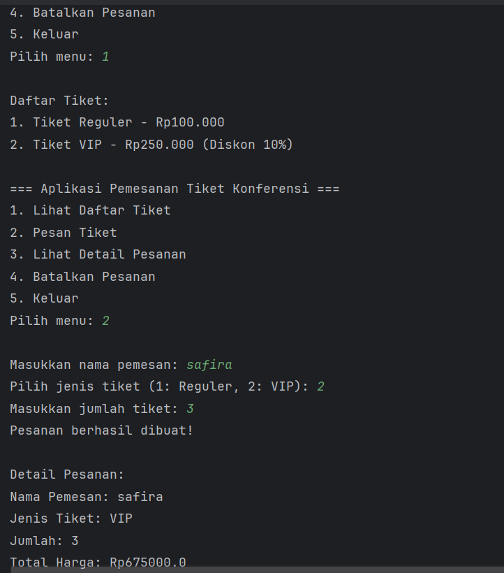

## BAB III - PENUTUP

### 3.1 Analisa

Berdasarkan praktikum yang telah dilakukan, dapat dianalisa bahwa:
1. **Class dan Object** merupakan fondasi utama dalam OOP. Class berfungsi sebagai blueprint sedangkan object adalah hasil instansiasi dari class tersebut yang memiliki state dan behavior.
2. **Attribute dan Method** adalah komponen penting dalam class. Attribute merepresentasikan data yang dimiliki objek, sedangkan method merepresentasikan perilaku atau fungsi yang dapat dilakukan objek.
3. **Akses Modifier** menentukan tingkat akses dari class, atribut, dan method. Penggunaan `public`, `private`, `protected`, dan `default` sangat penting untuk mengatur visibilitas dan keamanan data.
4. **Setter dan Getter** digunakan untuk mengakses dan memodifikasi atribut yang bersifat `private`, sehingga data tetap terlindungi namun masih dapat diakses dari luar class.
5. **Constructor** adalah method khusus yang dipanggil saat object dibuat. Constructor dapat berupa default constructor, parameterized constructor, maupun constructor overloading.
6. **Encapsulation** membantu melindungi data dengan menyembunyikan atribut menggunakan access modifier `private` dan mengaksesnya melalui getter dan setter.
7. **Inheritance** memungkinkan penggunaan kembali kode (reusability) dengan cara mewarisi atribut dan method dari superclass ke subclass menggunakan keyword `extends`.
8. **Composition** memberikan alternatif selain inheritance untuk membangun hubungan antar class dengan cara "has-a" yang lebih fleksibel dan tidak terikat hierarki.
9. **Polymorphism** memberikan fleksibilitas melalui method overriding dan method overloading, sehingga satu method dapat memiliki banyak bentuk implementasi.
10. **Abstraction** melalui abstract class dan interface memungkinkan kita mendefinisikan blueprint yang lebih umum dan memisahkan definisi dari implementasi.

### 3.2 Kesimpulan

Dari praktikum Lab 02 dan Lab 03 yang telah dilakukan, dapat disimpulkan bahwa Object-Oriented Programming (OOP) merupakan paradigma pemrograman yang sangat penting dalam pengembangan perangkat lunak modern. Konsep dasar OOP seperti class, object, attribute, method, akses modifier, setter-getter, dan constructor menjadi fondasi yang harus dikuasai sebelum mempelajari konsep yang lebih lanjut. Dengan memahami konsep-konsep dasar tersebut, pengembang dapat membangun program yang lebih terstruktur dan mudah dipahami.

Selain konsep dasar, empat pilar OOP yaitu Encapsulation, Inheritance, Polymorphism, dan Abstraction saling melengkapi dalam membangun aplikasi yang modular dan mudah dipelihara. Encapsulation melindungi data dari akses yang tidak diinginkan, Inheritance memungkinkan penggunaan kembali kode, Polymorphism memberikan fleksibilitas dalam implementasi method, dan Abstraction menyembunyikan detail implementasi sehingga program lebih mudah digunakan. Selain keempat pilar tersebut, Composition juga berperan penting sebagai alternatif Inheritance dalam membangun hubungan antar class yang lebih fleksibel.

Java sebagai bahasa pemrograman yang mendukung penuh konsep OOP terbukti sangat cocok digunakan untuk mengimplementasikan seluruh konsep tersebut. Dengan menguasai OOP menggunakan Java, pengembang dapat membangun aplikasi yang lebih kompleks, modular, dan mudah dikembangkan lebih lanjut.

### 3.3 Referensi

1. Modul Praktikum Lab 02 - Review Konsep Dasar OOP Menggunakan Java.
   - https://hackmd.io/@mohdrzu/Bygtu8g0iJg
2. Modul Praktikum Lab 03 - Review 4 Pilar OOP Menggunakan Java.
   - https://hackmd.io/@mohdrzu/Bygtu8g0iJg
3. W3Schools. (2024). *Java OOP*.
   - https://www.w3schools.com/java/java_oop.asp


